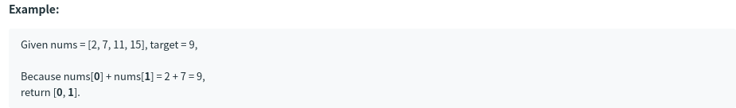

# [1. Two Sum](https://leetcode.com/problems/two-sum/)

## 题意

## 样例

## 解题方案
```java
class Solution {
    public int[] twoSum(int[] nums, int target) {
        int[] res = new int[2];
        HashMap<Integer, Integer> map = new HashMap<Integer, Integer>();
        for (int i = 0; i < nums.length; i++) {
            if (map.containsKey(target - nums[i])) {
                res[1] = i;
                res[0] = map.get(target - nums[i]);
            } else {
                map.put(nums[i], i);
            }
        }
        return res;
    }
}
```
