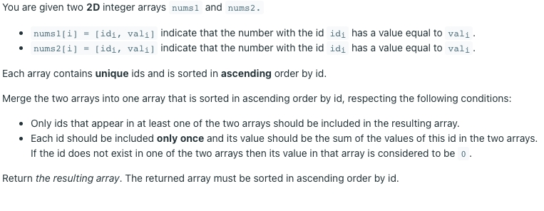
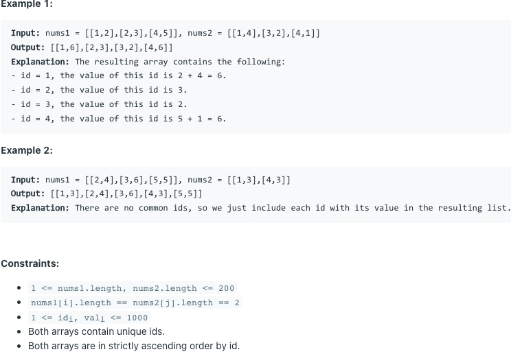

# [2570. Merge Two 2D Arrays by Summing Values](https://leetcode.com/problems/merge-two-2d-arrays-by-summing-values/)
## 题意

## 样例

## 解题方案
```java
class Solution {
    public int[][] mergeArrays(int[][] nums1, int[][] nums2) {
        int len1 = nums1.length;
        int len2 = nums2.length;
        int[][] rs = new int[len1 + len2][2];
        int index = 0;
        int i = 0;
        int j = 0;
        while (i < len1 && j < len2) {
            int a = nums1[i][0];
            int b = nums2[j][0];
            if (a == b) {
                rs[index][0] = a;
                rs[index++][1] = nums1[i++][1] + nums2[j++][1];
            } else if (a < b) {
                rs[index][0] = a;
                rs[index++][1] = nums1[i++][1];
            } else {
                rs[index][0] = b;
                rs[index++][1] = nums2[j++][1];
            }
        }
        while (i < len1) {
            int a = nums1[i][0];
            rs[index][0] = a;
            rs[index++][1] = nums1[i++][1];
        }
        while (j < len2) {
            int a = nums2[j][0];
            rs[index][0] = a;
            rs[index++][1] = nums2[j++][1];
        }
        return Arrays.copyOfRange(rs, 0, index);
    }
}
```