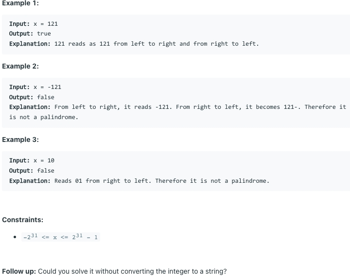

# [9. Palindrome Number](https://leetcode.com/problems/palindrome-number/)
## 题意

## 样例

## 解题方案
```java
class Solution {
    public boolean isPalindrome(int x) {
        if (x < 0) {
            return false;
        }
        int v = 0;
        int s = x;
        while (x != 0) {
            v = v * 10 + x % 10;
            x = x / 10;
        }
        return s == v;
    }
}
```