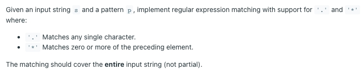
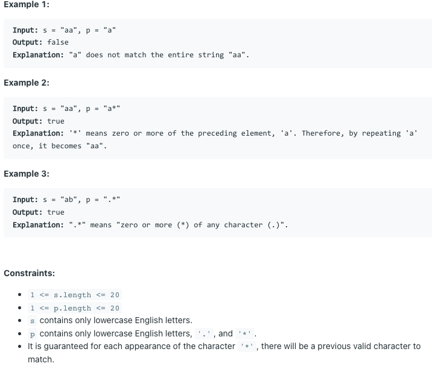

# [10. Regular Expression Matching](https://leetcode.com/problems/regular-expression-matching/)

## 题意

## 样例

## 解题方案
```java
class Solution {
    public boolean isMatch(String s, String p) {
        int lenS = s.length();
        int lenP = p.length();
        boolean[][] dp = new boolean[lenS + 1][lenP + 1];
        dp[0][0] = true;
        for (int i = 1; i <= lenP; i++) {
            if (p.charAt(i - 1) == '*') {
                dp[0][i] = i > 1 && dp[0][i - 2];
            }
        }
        for (int i = 1; i <= lenS; i++) {
            dp[i][0] = false;
        }
        for (int i = 1; i <= lenP; i++) {
            for (int j = 1; j <= lenS; j++) {
                if (s.charAt(j - 1) == p.charAt(i - 1) || p.charAt(i - 1) == '.') {
                    dp[j][i] = dp[j - 1][i - 1];
                    continue;
                }
                if (p.charAt(i - 1) == '*') {
                    if (p.charAt(i - 2) == s.charAt(j - 1) || p.charAt(i - 2) == '.') {
                        dp[j][i] = dp[j][i - 2] || dp[j][i - 1] || dp[j - 1][i];
                        continue;
                    }
                    dp[j][i] = dp[j][i - 2];
                    continue;
                }
                dp[j][i] = false;
            }
        }
        return dp[lenS][lenP];
    }
}
```