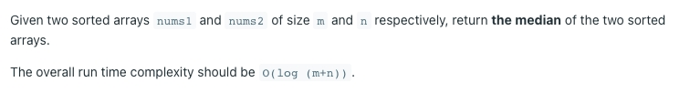

# [4. Median of Two Sorted Arrays](https://leetcode.com/problems/median-of-two-sorted-arrays/)
## 题意

## 样例

## 解题方案
```java
class Solution {
    public double findMedianSortedArrays(int[] nums1, int[] nums2) {
        int len1 = nums1.length;
        int len2 = nums2.length;
        int index = 0;
        int i = 0;
        int j = 0;
        int[] nums = new int[len1 + len2];
        while (i < len1 || j < len2) {
            if (i < nums1.length && j < nums2.length) {
                if (nums1[i] < nums2[j]) {
                    nums[index++] = nums1[i++];
                } else {
                    nums[index++] = nums2[j++];
                }
                continue;
            }
            if (i < len1) {
                nums[index++] = nums1[i++];
            }
            if (j < len2) {
                nums[index++] = nums2[j++];
            }
        }
        if (nums.length % 2 == 0) {
            int mid = nums.length / 2;
            return (nums[mid] + nums[mid - 1]) / 2.0;
        }
        return nums[nums.length / 2];
    }
}
```