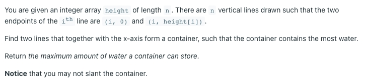
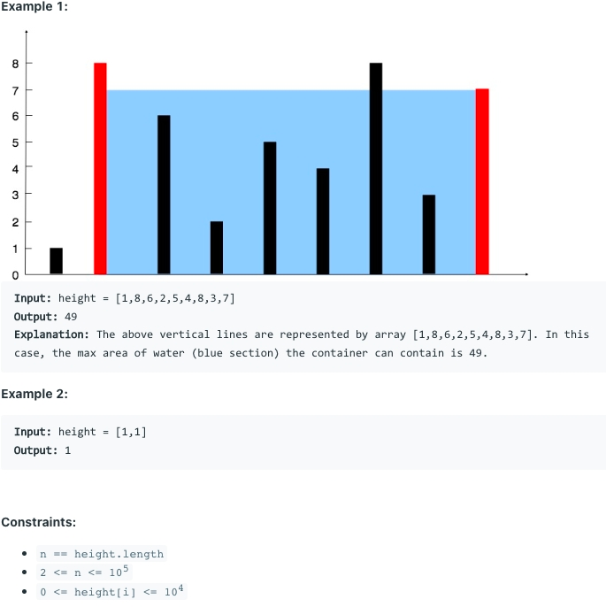

# [11. Container With Most Water](https://leetcode.com/problems/container-with-most-water/)
## 题意

## 样例

## 解题方案
```java
class Solution {
    public int maxArea(int[] height) {
        int left = 0, right = height.length - 1;
        int max = 0;
        while (left < right) {
            int mid = Math.min(height[left], height[right]);
            max = Math.max(max, mid * (right - left));
            while (left < right && height[left] <= mid) left++;
            while (left < right && height[right] <= mid) right--;
        }
        return max;
    }
}
```