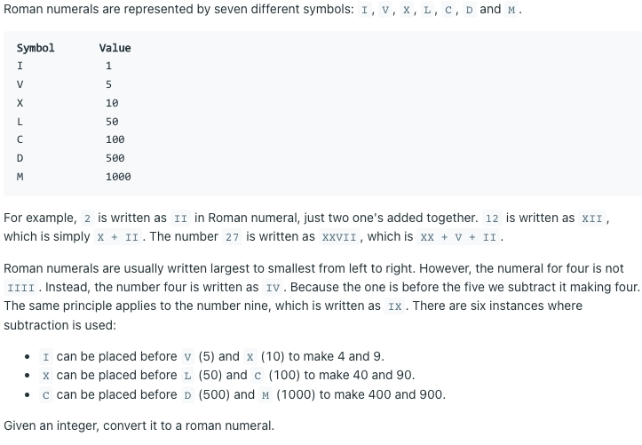
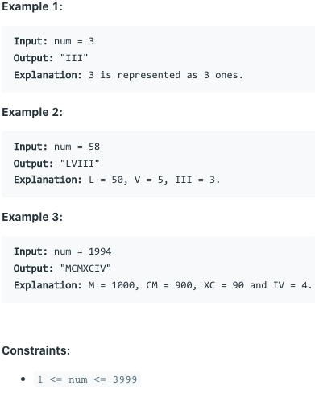

# [12. Integer to Roman](https://leetcode.com/problems/integer-to-roman/)
## 题意

## 样例

## 解题方案
```java
class Solution {
    int[] values = {1000, 900, 500, 400, 100, 90, 50, 40, 10, 9, 5, 4, 1};
    String[] keys = {"M", "CM", "D", "CD", "C", "XC", "L", "XL", "X", "IX", "V", "IV", "I"};

    public String intToRoman(int num) {
        StringBuilder builder = new StringBuilder();
        for (int i = 0; i < values.length; i++) {
            while (num >= values[i]) {
                num = num - values[i];
                builder.append(keys[i]);
            }
        }
        return builder.toString();
    }
}
```