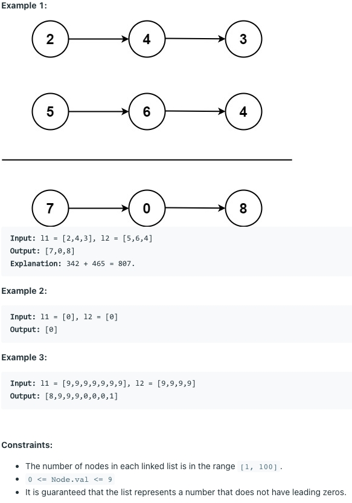

# [2. Add Two Numbers](https://leetcode.com/problems/add-two-numbers/)

## 题意

## 样例

## 解题方案
```java
class Solution {
    public ListNode addTwoNumbers(ListNode node1, ListNode node2) {
        ListNode parent = new ListNode();
        ListNode pre = parent;
        int cary = 0;
        while (node1 != null || node2 != null) {
            if (node1 != null) {
                cary += node1.val;
                node1 = node1.next;
            }
            if (node2 != null) {
                cary += node2.val;
                node2 = node2.next;
            }
            pre.next = new ListNode(cary % 10);
            pre = pre.next;
            cary = cary / 10;
        }
        if (cary > 0) {
            pre.next = new ListNode(cary);
        }
        return parent.next;
    }
}
```