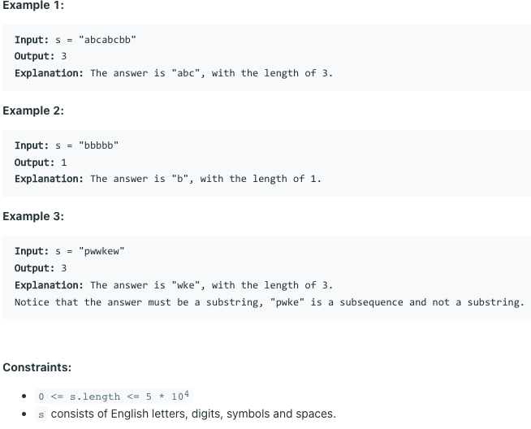

# [3. Longest Substring Without Repeating Characters](https://leetcode.com/problems/longest-substring-without-repeating-characters/)

## 题意

## 样例

## 解题方案
```java
class Solution {
    public int lengthOfLongestSubstring(String s) {
        if (s == null || s.length() == 0) {
            return 0;
        }
        HashMap<Character, Integer> map = new HashMap<>();
        int max = 0;
        int pre = 0;
        for (int i = 0; i < s.length(); i++) {
            char c = s.charAt(i);
            if (map.containsKey(c)) {
                int index = map.get(c);
                for (int j = pre; j <= index; j++) {
                    map.remove(s.charAt(j));
                }
                pre = index + 1;
            }
            max = Math.max(max, i - pre + 1);
            map.put(c, i);
        }
        return max;
    }
}
```