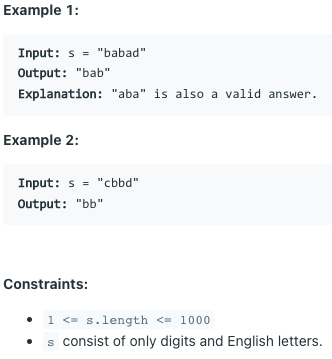

# [5. Longest Palindromic Substring](https://leetcode.com/problems/longest-palindromic-substring/)
## 题意

## 样例

## 解题方案
```java
class Solution {
    public String longestPalindrome(String s) {
        String value = "";
        for (int i = 0; i < s.length(); i++) {
            String v = helper(s, i, i);
            if (v.length() > value.length()) {
                value = v;
            }
            v = helper(s, i, i + 1);
            if (v.length() > value.length()) {
                value = v;
            }
        }
        return value;
    }

    private String helper(String s, int left, int right) {
        while (left >= 0 && right < s.length() && s.charAt(left) == s.charAt(right)) {
            left--;
            right++;
        }
        return s.substring(left + 1, right);
    }
}
```