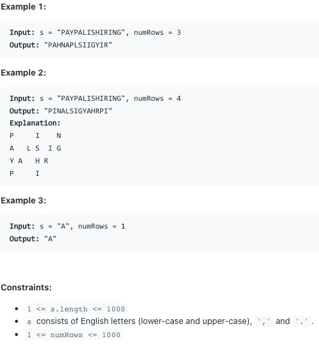

# [6. Zigzag Conversion](https://leetcode.com/problems/zigzag-conversion/)
## 题意

## 样例

## 解题方案
```java
class Solution {
    public String convert(String s, int numRows) {
        StringBuilder builder = new StringBuilder();
        int maxStep = 2 * (numRows - 1);
        if (maxStep==0){
            return s;
        }
        for (int i = 0; i < numRows; i++) {
            int index = i;
            int step = maxStep - 2 * i;
            step = step == 0 || step == maxStep ? maxStep : step;
            while (index < s.length()) {
                builder.append(s.charAt(index));
                index += step;
                step = step == maxStep ? maxStep : maxStep - step;
            }
        }
        return builder.toString();
    }
}
```