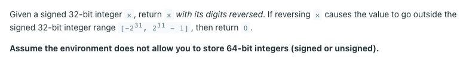
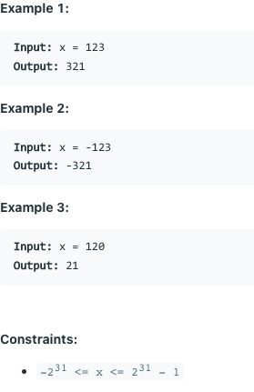

# [7. Reverse Integer](https://leetcode.com/problems/reverse-integer/)

## 题意

## 样例

## 解题方案
```java
class Solution {
    public int reverse(int x) {
        int cnt = 0;
        while (x / 10 != 0) {
            int div = x % 10;
            x = x / 10;
            cnt = cnt * 10 + div;
        }
        if (cnt>(Integer.MAX_VALUE/10)||cnt<(Integer.MIN_VALUE/10)){
            return 0;
        }
        cnt = cnt * 10 + x % 10;
        return cnt;
    }
}
```