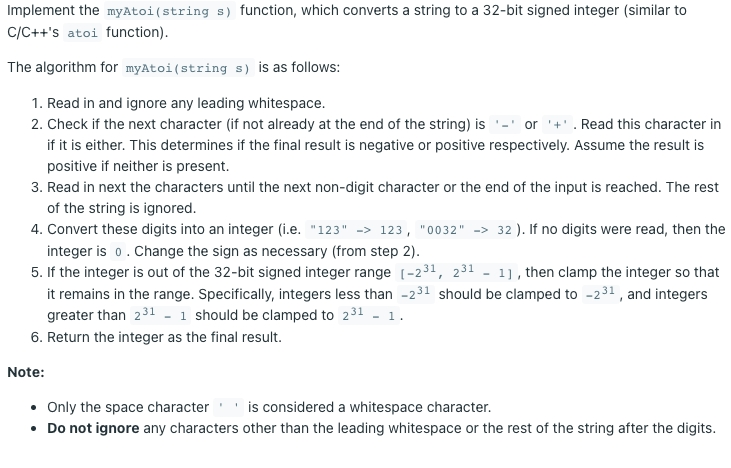
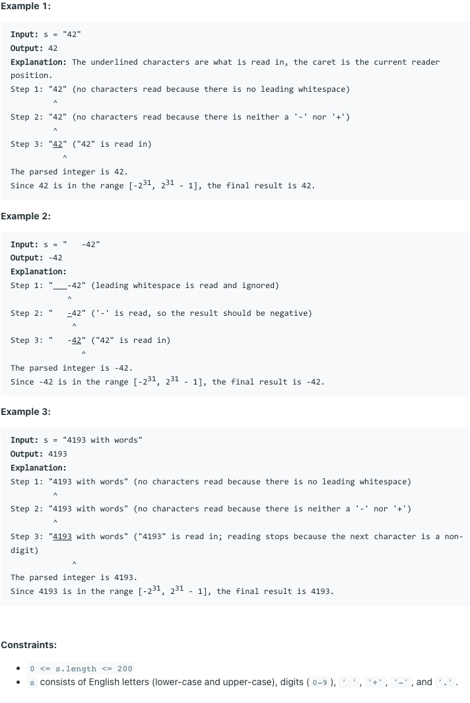

# [8. String to Integer (atoi)](https://leetcode.com/problems/string-to-integer-atoi/)
## 题意

## 样例

## 解题方案
```java
class Solution {
    public int myAtoi(String s) {
        s = s.trim();
        int tag = 0;
        long v = 0L;
        int digit = 0;
        for (char c : s.toCharArray()) {
            if (c == '+') {
                if (tag != 0 || digit > 0) {
                    break;
                }
                tag = 1;
                continue;
            }
            if (c == '-') {
                if (tag != 0 || digit > 0) {
                    break;
                }
                tag = -1;
                continue;
            }
            if (!Character.isDigit(c)) {
                break;
            }
            v = v * 10 + c - '0';
            digit++;
            if ((tag == 0 || tag == 1) && v >= Integer.MAX_VALUE) {
                return Integer.MAX_VALUE;
            }
            if (tag == -1 && v - 1 >= Integer.MAX_VALUE) {
                return Integer.MIN_VALUE;
            }
        }
        return (int) (v * (tag == 0 ? 1 : tag));
    }
}
```